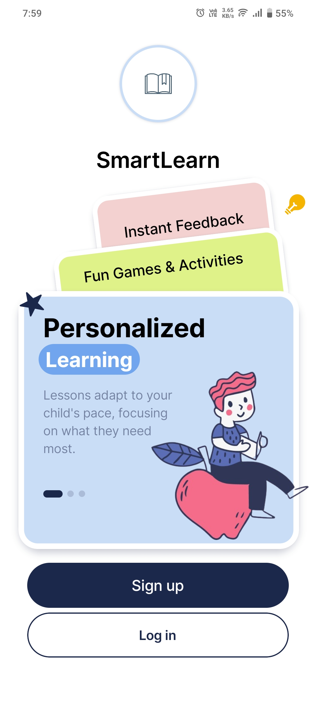
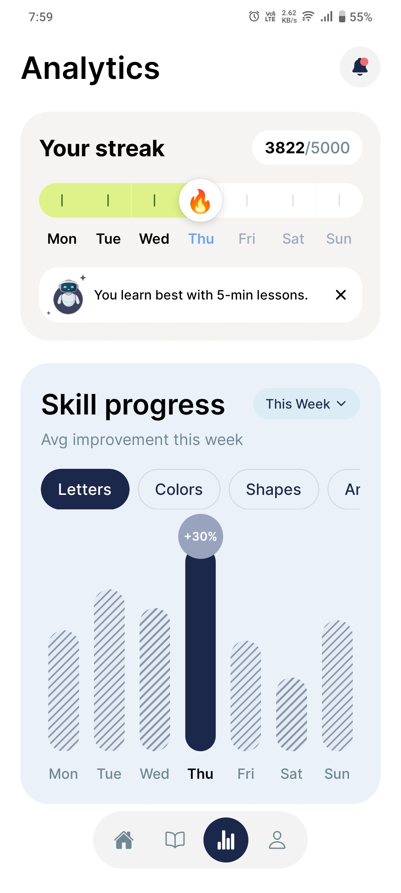
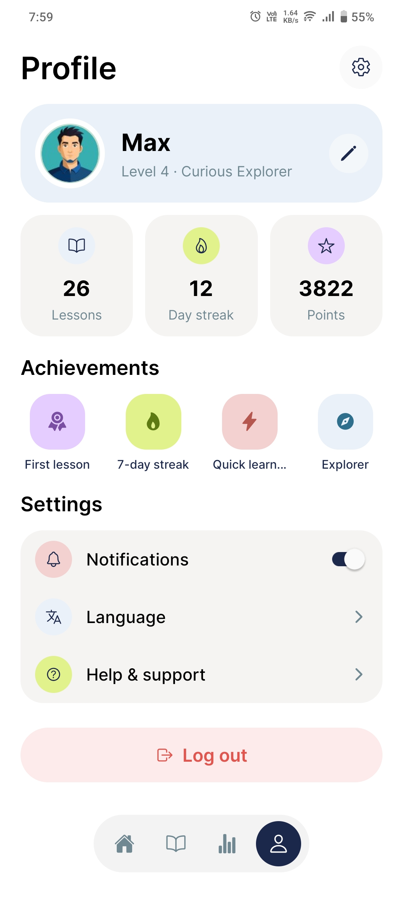

# SmartLearn

A cross-platform **React Native + TypeScript** app that reproduces the
[`Assignment - React Native`](https://www.figma.com/design/tTurVwDccYbrqTqXLwRClW/Assignment---React-Native)
Figma design. Built on the **Expo managed workflow** with **React Navigation**
(native-stack + nested bottom tabs), a typed design-token layer, **light-mode
theming**, smooth micro-interactions, and bundled Inter fonts.

The app implements four screens: **Onboarding** (entry), **Home**, **Analytics**,
and **LessonDetail**.

---

## Prerequisites

- **Node.js** 18 LTS or newer and **npm** (bundled with Node).
- **Expo CLI** is invoked through `npx`/local scripts — no global install needed.
- **iOS:** macOS with **Xcode** + an iOS Simulator (or the Expo Go app on a
  physical device).
- **Android:** **Android Studio** with an emulator/AVD configured, or the Expo
  Go app on a physical device.
- A physical device only needs the **Expo Go** app for the quickest path.

---

## Install

From the repository root:

```bash
npm install
```

This installs all dependencies pinned in `package.json` (Expo SDK 56,
React Native 0.85, React Navigation 7, the Inter font package, and the test/lint
toolchain).

---

## Run

The fastest way to preview on either platform is the Expo dev server with the
**Expo Go** app or a simulator/emulator.

### Start the dev server (iOS + Android via Expo Go)

```bash
npm start
```

Then, from the Expo CLI prompt:

- Press **`i`** to open the **iOS Simulator** (macOS only).
- Press **`a`** to open the **Android emulator**.
- Or scan the shown QR code with the **Expo Go** app on a physical device
  (iOS: Camera app; Android: Expo Go scanner).

### iOS — ordered steps

1. `npm install`
2. (macOS) Open the iOS Simulator via Xcode, or have Expo Go installed on a device.
3. `npm start`
4. Press **`i`** in the Expo CLI to launch the simulator, or scan the QR code
   with Expo Go on a device.
5. The app opens on the **Onboarding** screen.

For a full native build (instead of Expo Go):

```bash
npm run ios
```

> `npm run ios` (`expo run:ios`) compiles a native iOS build and requires a
> macOS machine with Xcode and CocoaPods installed.

### Android — ordered steps

1. `npm install`
2. Launch an Android emulator from Android Studio, or have Expo Go installed on a device.
3. `npm start`
4. Press **`a`** in the Expo CLI to launch the emulator, or scan the QR code
   with Expo Go on a device.
5. The app opens on the **Onboarding** screen.

For a full native build (instead of Expo Go):

```bash
npm run android
```

> `npm run android` (`expo run:android`) compiles a native Android build and
> requires Android Studio with an SDK and emulator configured.

---

## Available scripts

| Script              | Command            | Purpose                                            |
| ------------------- | ------------------ | -------------------------------------------------- |
| `npm start`         | `expo start`       | Start the Metro/Expo dev server (Expo Go).         |
| `npm run ios`       | `expo run:ios`     | Build and run a native iOS app (macOS only).       |
| `npm run android`   | `expo run:android` | Build and run a native Android app.                |
| `npm run web`       | `expo start --web` | Run in the browser (best-effort; mobile-first).    |
| `npm run typecheck` | `tsc --noEmit`     | Strict TypeScript type checking.                   |
| `npm test`          | `jest`             | Run the unit + property-based test suite.          |
| `npm run lint`      | `eslint …`         | Lint, including `react-native/no-inline-styles`.   |

---

## Project structure

```
Kraftbase/
├─ App.tsx                 # Entry: font loading, splash gating, providers, navigation
├─ index.ts                # registerRootComponent + gesture-handler init
├─ app.json                # Expo config (splash, fonts, appearance, bundle ids)
└─ src/
   ├─ assets/              # Bundled fonts and images
   ├─ components/          # Reusable UI (Button, Card, LessonCard, BarChart, …)
   ├─ lib/                 # Pure helpers (fonts fallback, responsive scaling)
   ├─ navigation/          # RootNavigator, route param types
   ├─ screens/             # Onboarding, Home, Analytics, LessonDetail, Profile
   ├─ theme/               # Design tokens + ThemeProvider (colors/spacing/radius/typography)
   └─ types/               # Ambient type declarations
```

---

## Assumptions and decisions

### Decisions

- **Expo managed workflow over bare React Native.** Chosen for a faster, more
  reproducible setup and one-command runs on both platforms via Expo Go. This
  keeps the reviewer's path to running the app minimal.
- **React Navigation (not Expo Router).** A native-stack navigator hosts
  `Onboarding` as the initial route and `LessonDetail` as a full-screen route;
  a nested bottom-tab navigator hosts `Home` and `Analytics`. This mirrors the
  navigation controls indicated in the Figma design.
- **Typed Design Token layer as the single source of visual truth.** Colors,
  spacing, radii, and typography live in `src/theme/*` and are consumed via a
  `makeStyles(theme)` factory per component. No inline style literals are used,
  satisfying the consistent-styling requirement.
- **Light-mode only theming.** Per the product decision the app is pinned to the
  light theme: `ThemeProvider` always resolves `getTheme('light')` and does not
  subscribe to the device color scheme, and `app.json` sets
  `userInterfaceStyle: "light"`. The status bar is forced to dark content
  (`<StatusBar style="dark" />`) so it stays legible on the light backgrounds.
  `getTheme` remains a total resolver (its dark branch is still unit/property
  tested), but the running app never switches to dark. `useTheme()` throws if
  used outside the provider to catch wiring mistakes early.
- **Smooth micro-interactions (bonus).** A reusable `PressableScale` primitive
  springs interactive controls down on press, and screens use native-driver
  `Animated` entrance transitions (eased fade + slide). Frosted-glass surfaces
  use `expo-blur`.
- **Fonts loaded via `expo-font` with splash gating.** The native splash is held
  until the Inter font families resolve, so text never flashes in a fallback
  face. If a font fails to load, the app continues with a documented system
  fallback rather than blocking.
- **Property-based testing with `fast-check` + `jest-expo`.** Pure logic (theme
  resolution/completeness, font fallback totality, responsive scaling,
  data-driven state selection) is validated with property tests; UI is covered
  by snapshot/example tests and lint.

### Assumptions

- Exact Figma values (color hex codes, spacing scale, radii, typography) were
  **extracted during task 1.1** and transcribed into the token files. Those
  tokens are treated as the source of visual truth for the implementation.
- The Inter family (via `@expo-google-fonts/inter`) is the typeface specified by
  the design; weights 400/500/600/700 are bundled.
- Screen content (lessons, streaks, skill progress) is sourced from local
  fixture/mock data to populate the Filled_State, since no backend is in scope.
- A device set to dark appearance still receives the **light** theme — the app
  is intentionally light-mode only and has no in-app theme toggle.

---

## Screenshots / screen recording

| Onboarding | Home | Analytics |
| :--------: | :--: | :-------: |
|  |  |  |

| Lesson Detail | Profile |
| :-----------: | :-----: |
|  |  |

**Screen recording:** [`screenshots/Screenrecording_20260613_195736.mp4`](screenshots/Screenrecording_20260613_195736.mp4) — a short walkthrough of the running app.

---

## Verifying the project

```bash
npm run typecheck   # strict TS, no emit
npm test            # unit + property-based tests
npm run lint        # ESLint incl. no-inline-styles
```
